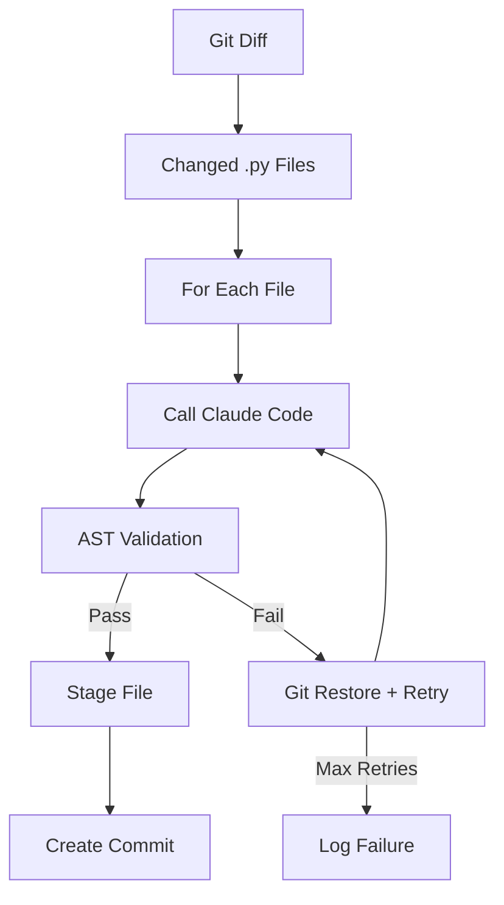

# Auto-Docs Action

[](https://github.com/dominiquegarmier/auto-docs-action/actions)
[](https://opensource.org/licenses/MIT)

GitHub Action that automatically updates Python docstrings using Claude Code CLI. When Python files are modified, this action uses AI to add or improve Google-style docstrings while ensuring no logic changes through AST validation.

## ✨ Features

- 🤖 **AI-Powered**: Uses Claude Code CLI to generate high-quality docstrings
- 🔒 **Safe**: AST validation ensures only docstrings are modified, never logic
- 🔄 **Reliable**: Retry logic with `git restore` for clean failure recovery
- 📝 **Google Style**: Enforces Google-style docstring format
- ⚡ **Efficient**: Only processes files that actually changed
- 🪵 **Transparent**: Rich logging shows exactly what was modified

## 🚀 Usage

Add this to your `.github/workflows/auto-docs.yml`:

```yaml
name: Auto-update docstrings

on:
  push:
    branches: [ main ]
    paths: [ '**.py' ]  # Only run when Python files change

permissions:
  contents: write  # Required to push commits

jobs:
  auto-docs:
    runs-on: ubuntu-latest
    # Prevent infinite loops - skip if triggered by the action itself
    if: github.actor != 'github-actions[bot]'
    steps:
      - uses: actions/checkout@v5
        with:
          token: ${{ secrets.GITHUB_TOKEN }}

      - name: Update docstrings
        uses: dominiquegarmier/auto-docs-action@v1
        with:
          anthropic_api_key: ${{ secrets.ANTHROPIC_API_KEY }}
          max_retries: 2
```

### Required Setup

1. **Get an Anthropic API key** from [console.anthropic.com](https://console.anthropic.com)
2. **Add it as a repository secret** named `ANTHROPIC_API_KEY`
3. **Ensure workflow has write permissions** to push commits

### Action Inputs

| Input | Required | Default | Description |
|-------|----------|---------|-------------|
| `anthropic_api_key` | ✅ | | Your Anthropic API key for Claude Code |
| `max_retries` | | `2` | Maximum retry attempts per file |

### Action Outputs

| Output | Description |
|--------|-------------|
| `files_processed` | Total number of Python files processed |
| `files_successful` | Number of files successfully updated |
| `files_failed` | Number of files that failed processing |

## 🔧 How It Works

1. **Detects Changes**: Finds Python files modified in the latest commit
2. **AI Processing**: For each file, Claude Code analyzes and adds missing docstrings
3. **Safety Validation**: AST comparison ensures only docstrings were changed
4. **Retry Logic**: If validation fails, restores file and retries (up to max_retries)
5. **Commit Changes**: Creates a clean commit with all successfully updated files



## 🛡️ Safety Guarantees

- **AST Validation**: Mathematical proof that only docstrings changed
- **No Logic Modifications**: Function signatures, imports, and code logic remain untouched
- **Rollback on Failure**: `git restore` ensures clean state between retry attempts
- **Audit Trail**: Complete logging of all operations and changes

## 🧪 Example

**Before** (missing docstrings):
```python
def calculate_area(length, width):
    return length * width

class Rectangle:
    def __init__(self, length, width):
        self.length = length
        self.width = width
```

**After** (docstrings added):
```python
def calculate_area(length, width):
    """Calculate the area of a rectangle.

    Args:
        length: The length of the rectangle.
        width: The width of the rectangle.

    Returns:
        The area of the rectangle.
    """
    return length * width

class Rectangle:
    """A rectangle class for geometric calculations."""

    def __init__(self, length, width):
        """Initialize a rectangle.

        Args:
            length: The length of the rectangle.
            width: The width of the rectangle.
        """
        self.length = length
        self.width = width
```

## 🏗️ Development

This project uses [uv](https://docs.astral.sh/uv/) for dependency management.

```bash
# Install dependencies
uv sync --dev

# Run tests
uv run pytest

# Run with coverage
uv run pytest --cov=.

# Code quality checks
uv run pre-commit run --all-files
```

### Project Structure

```
├── main.py                     # Entry point
├── git_operations.py           # Git commands via subprocess (function-based)
├── ast_validator.py            # AST-based safety validation (function-based)
├── docstring_updater.py        # Claude Code CLI interface (function-based)
├── file_processor.py           # Retry logic orchestrator (class-based)
├── action.yml                  # GitHub Action configuration
└── tests/                      # Comprehensive test suite (function-based tests)
```

## 📖 Documentation

- [TODO.md](TODO.md) - Implementation tasks and progress
- [IMPLEMENTATION_NOTES.md](IMPLEMENTATION_NOTES.md) - Architecture and design decisions
- [TESTING_STRATEGY.md](TESTING_STRATEGY.md) - Testing approach and examples

## 🤝 Contributing

1. Fork the repository
2. Create a feature branch (`git checkout -b feature/amazing-feature`)
3. Make your changes and add tests
4. Ensure tests pass (`uv run pytest`)
5. Run pre-commit hooks (`uv run pre-commit run --all-files`)
6. Commit your changes (`git commit -m 'Add amazing feature'`)
7. Push to the branch (`git push origin feature/amazing-feature`)
8. Open a Pull Request

## 📄 License

This project is licensed under the MIT License - see the [LICENSE](LICENSE) file for details.

## ❓ Troubleshooting

### "No API key provided"
Make sure you've added `ANTHROPIC_API_KEY` to your repository secrets.

### "Permission denied"
Ensure your workflow has write permissions to push commits:
```yaml
permissions:
  contents: write
```

### "Claude Code not found"
The action automatically installs Claude Code CLI. If you see this error, please file an issue.

### Files not being processed
Check that:
- Python files were actually modified in the latest commit
- Files have valid Python syntax
- The workflow is triggered on the correct events

---

Built with ❤️ using [Claude Code](https://claude.ai/code)
